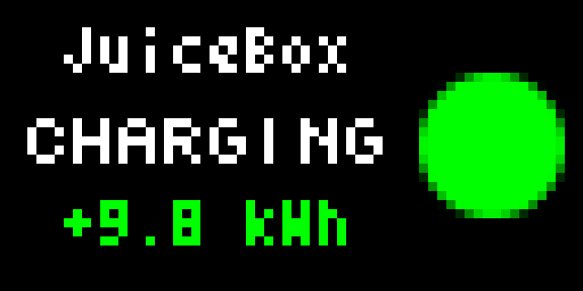

# juicenet-pixlet

A pixlet, built for Tidbyt, that gives info about your EV charging JuiceBox devices.

## TODO:

- [X] Add charger_id as configuration option (now required)
- [ ] Build schema to allow users to configure with their own API token, device_id, etc.
- [ ] Improve animations
- [ ] Add JuiceBox text somewhere to make it more obvious that's what this is referring to

## Examples

### Charging

### Plugged in (but not charging)

### Standby

